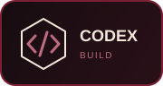
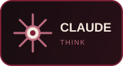
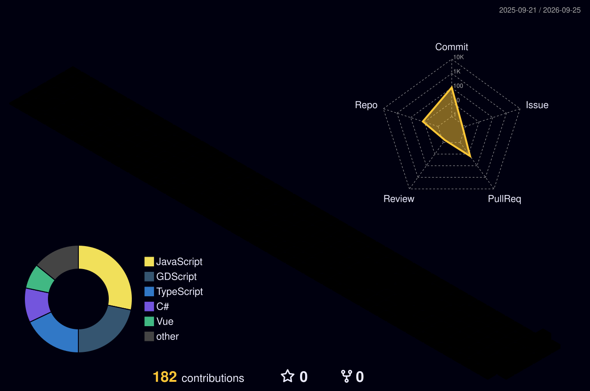
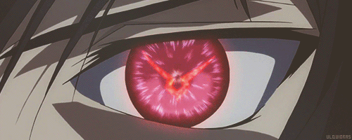

<div align="center">
  
</div>

<br>

> Construyendo mi camino en el desarrollo de software, una idea y un desafío a la vez.

```yaml
location:       Manta, Ecuador
education:      Ingeniería de Software · ULEAM
current_stage:  Quinto semestre
focus:          Desarrollo web y soluciones con IA
goal:           Aprender, colaborar y obtener experiencia profesional
```

Software Engineering student focused on web development, continuous learning, and turning ideas into useful digital experiences.


<h2>
  
  How I Build
</h2>

<table>
  <tr>
    <td align="center" width="50%">
      <h3>Frontend</h3>
      
    </td>
    <td align="center" width="50%">
      <h3>Backend & Data</h3>
      
    </td>
  </tr>
  <tr>
    <td align="center" colspan="2">
      <h3>Tools & Cloud</h3>
      
    </td>
  </tr>
</table>

<div align="center">
  <h3>AI-assisted workflow</h3>
  <p>Agentes que utilizo para explorar ideas, aprender y mejorar mi proceso de desarrollo.</p>
  
  
  
</div>


## 🎧 Current Rotation

<div align="center">
  <a href="https://spotify-github-profile.kittinanx.com/api/view?uid=21feesshqxtx6sqd57rvt2pfa&redirect=true">
    
  </a>
</div>


## 🎮 Current Quest

```text
[ACTIVE]  Crear aplicaciones web modernas y accesibles
[ACTIVE]  Integrar servicios y bases de datos con Supabase
[ACTIVE]  Utilizar agentes de IA de forma responsable durante el desarrollo
[NEXT]    Fortalecer mis fundamentos de ingeniería de software
```


## 🚀 Featured Builds

<table>
  <tr>
    <td width="50%" valign="top">
      <h3 align="center"><a href="https://github.com/JagoWoa/Grupo-Interfaces">Grupo Interfaces</a></h3>
      <p>Aplicación web colaborativa construida con Angular, internacionalización y una interfaz moderna conectada con servicios de datos.</p>
      <p align="center">
        
        
        
      </p>
    </td>
    <td width="50%" valign="top">
      <h3 align="center"><a href="https://github.com/JagoWoa/GobTurnos-inteligente">GobTurnos Inteligente</a></h3>
      <p>Sistema web de turnos gubernamentales con flujos ciudadanos, gestión operativa y una interfaz enfocada en accesibilidad.</p>
      <p align="center">
        
        
        
      </p>
    </td>
  </tr>
  <tr>
    <td colspan="2" valign="top">
      <h3 align="center"><a href="https://github.com/sebasbv11/Hackaton-shipyard-2.0">Hackaton Shipyard 2.0</a></h3>
      <p align="center">Videojuego móvil 2D desarrollado en equipo con Godot, compuesto por una experiencia principal y distintos minijuegos.</p>
      <p align="center">
        
        
        
      </p>
    </td>
  </tr>
</table>


## 🕹️ Player Stats & Activity

<div align="center">
  
  
</div>

<div align="center">
  
</div>


## Let's Connect

Puedes contactarme a través de:

<p>
  <a href="https://www.linkedin.com/in/jos%C3%A9-luis-sarabia-calder%C3%B3n-27179b303/">
    
  </a>
  <a href="mailto:jslssarabia@gmail.com">
    
  </a>
  <a href="https://www.instagram.com/jose.sarabiac/">
    
  </a>
  
</p>

<div align="center">
  
</div>

<sub>Manta, Ecuador · Always learning, always building.</sub>
